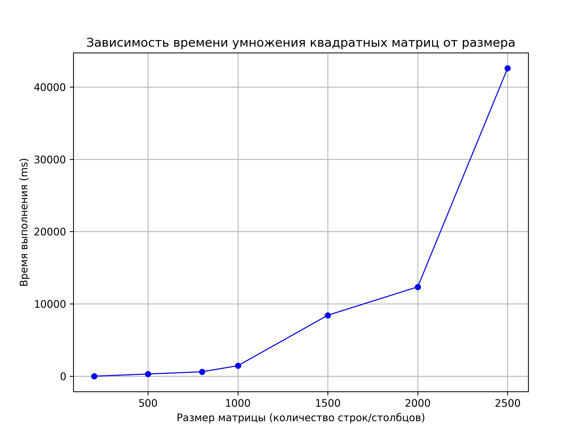
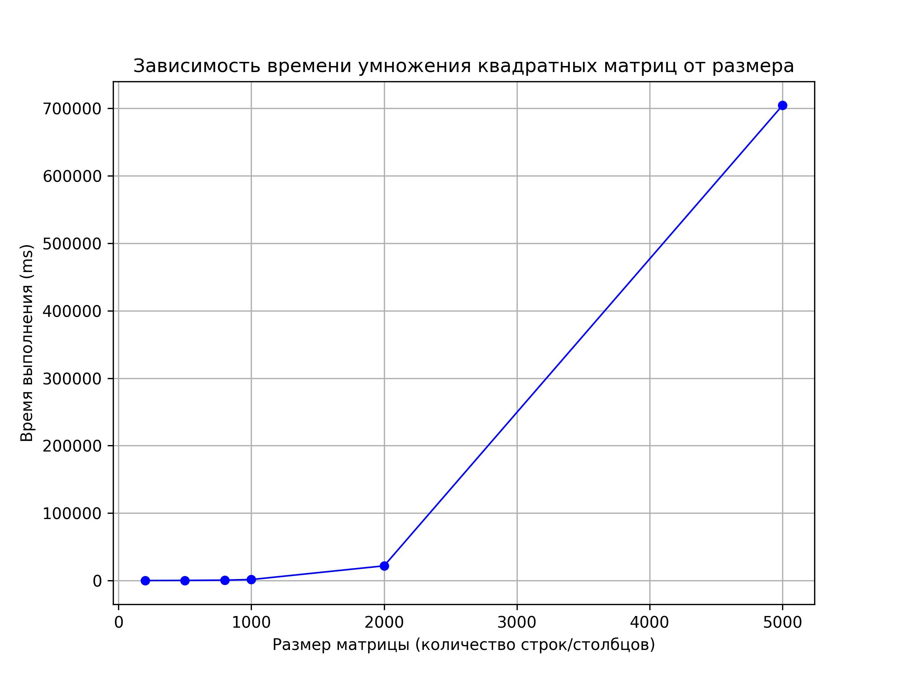

# parallel-programming-labs
# Отчёт по лабораторной работе № 1

**Выполнил:**  
Студент группы **6212-100503D**  
**Щукин Ярослав Владимирович**

---

## Задание

Написать программу на C/C++ для перемножения двух квадратных матриц.  
На вход — файл(ы) с исходными матрицами.  
На выход — файл с результатом, время работы, объём задачи.  
Обязательно проверить результат с помощью сторонних библиотек (например, Python или Matlab).

---

## Как сделано

Написано два файла:  
- **multiplier** — основная программа: загружает матрицы, умножает их, замеряет время, сохраняет результат.  
- **utils** — вспомогательные функции для работы с файлами, памятью и проверкой через numpy.

В главной функции программа:
1. Загружает сгенерированные матрицы.
2. Умножает их и замеряет время.
3. Автоматически сверяет результат с тем, что выдаёт **numpy** в Python.

Можно запустить несколько умножений подряд без перезапуска.  
Файл `input.txt` должен лежать в той же папке, что и программа. Формат: размерность, первая матрица, пустая строка, вторая матрица.

Все проверки прошли успешно. Получились такие графики:

---

## Вывод

Я написал программу на C/C++ с двумя файлами (`multiplier` и `utils`), которая перемножает квадратные матрицы и показывает, как время работы зависит от объёма данных.
